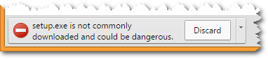
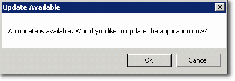
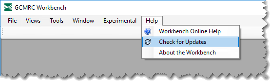

The GCMRC Workbench is a standalone, desktop software application. To install it you download and run the setup.exe application linked below. This will install the Cross Section Viewer in your user profile folder (not the Windows Program Files folder). Read the [release notes](/release_notes) for information on the latest features and updates.

<a class="btn btn-primary fa fa-cloud-download" href="http://releases.northarrowresearch.com/SandbarWorkbench/setup.exe">&nbsp;&nbsp;Sandbar Workbench <small><em>64-bit</em></small></a></li>
</ul>

## Prerequisites

The following software are required and must be installed before attempting to download and install the Sandbar Workbench software.

* 64 bit Windows XP or newer.
* Microsoft .Net Framework 4.5.2 (auto-installs if you don't have it).
* 10Mb free disk space for the software, plus enough space to store sandbar analysis results.

## Installation Process

Click on the link above to download the GCMRC  Workbench software `setup.exe` file. Certain internet browsers will warn about the potential risks of downloading executable files (see below). Check that the warning refers to the GCMRC Workbench file and then click to keep the file.

Once the `setup.exe` file download is complete, double click the file to run the installation routine and follow the prompts to complete the process. There are no options or choices during the installation.

Note that the Workbench does not require Administrator privileges to install and does not place any files in the `C:\Program Files` folder. The entire application is stored in the user's profile folder.

## Obtaining Updates

The Workbench software automatically checks for newer versions every time the software is launched. When a newer version is detected the user is prompted to install it.

Note that clicking cancel turns off the automated checking for updates permanently and the software will no longer prompt when newer versions are available. 

There is also a manual "Check for Updates" feature on the Help menu in the software.

